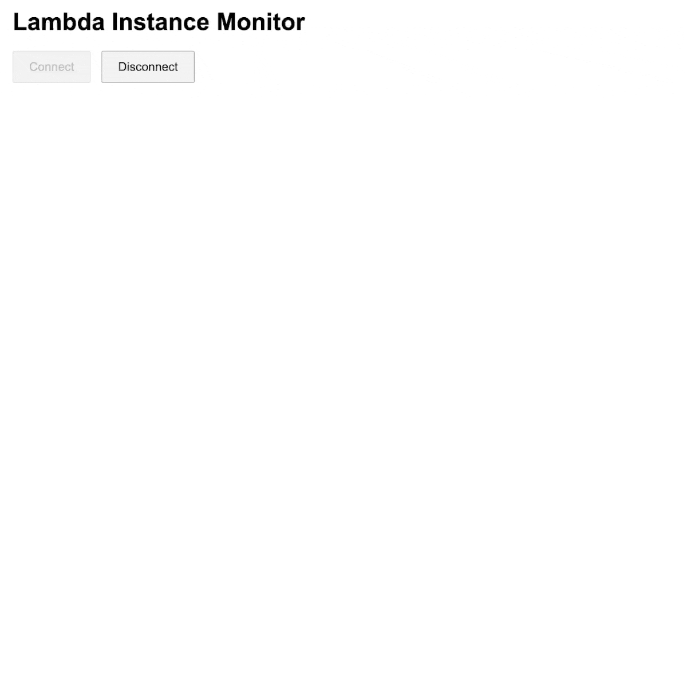

# AWS Lambda Visualizer

A real-time, event-based learning project to visualize AWS Lambda invocations. The provided CDK code provisions Lambdas, a public API Gateway, DynamoDB, EventBridge, and an S3-hosted static website.



  


## How to Run

1. **Deploy the Stack:** Ensure AWS CLI, Node.js, CDK, and jq are installed and configured, then run:
   
```bash
cdk deploy
```

2. **Update the Website:** After deployment, update the static website with the resolved WebSocket URL:

```bash
./update-website-post-deploy.sh
```

3. **Trigger Activity:** Simulate Lambda work by invoking the worker:

```bash
./trigger-worker-lambdas.sh
```

Open the website URL (from the deployment outputs) in your browser and connect to the WebSocket. You should see the invocations in real-time.

## Running on Production

This is a learning project and although you can just wrap your lambda handlers with the provided `monitor` higher-order function, be aware of the following:

1. The API Gateway is public, so anyone can connect to the WebSocket and see the invocation status.
2. Sending events in your lambdas could increase the time it takes to run and also increase costs.

Some ideas that you should consider if you want to run this in production:

1. Add an Authentication lambda to the API Gateway. 
2. If you have a backend that can handle the WebSocket connections, then authentication becomes easier, as you can just add a required API Key in the headers of the WebSocket connection. This would work with the Node WebSocket client, but unfortunately it doesn't work with the browser's WebSocket API.
